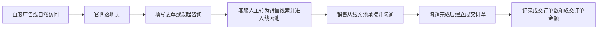

# GoodieAI 只读市场数据监控系统

> **现行产品定位（2026-08-04）**：本项目已从单一 GEO/SEO 监测更新为面向市场负责人的**只读市场数据监控系统**。GEO/SEO 是已经验证的一组正式能力，不是整个项目的唯一边界；市场工作台已部署，但数据成熟度必须按来源区分，不能把页面存在等同于完整营销漏斗接通。

GoodieAI 在同一个项目视角下逐步联合观察 GEO/SEO，以及按渠道归属的展现、官网访问、官网咨询、在线客服咨询、线索入池、成交订单数和成交订单金额。首页“官网咨询”当前只包含官网成功表单，不包含 53KF。广告点击是独立的百度营销事实，不代替百度统计访问。系统只读取、保存和分析来源事实；投放调整、咨询处理、线索与机会推进、订单维护仍在各来源系统完成。

## 项目定位与演进状态

产品定位与交付阶段必须分开判断：

| 层级 | 当前事实 |
| --- | --- |
| 现行产品定位 | 只读市场数据监控系统 |
| 当前正式工作流 | GEO、AI 搜索可见度与技术 SEO 监测 |
| 当前受限试点 | 百度搜索推广账户和百度统计网站访问的访问触发式 10 分钟数据库缓存；百度统计按 PC / 移动端及所选趋势来源隔离，真实数据仍仅对白名单项目开放 |
| 最终全链路目标 | 按内置渠道联合观察展现、百度统计访问、客服咨询、线索入池、成交订单数与成交订单金额 |

完整业务过程是：



这张图描述业务过程，不表示系统当前已经打通完整漏斗。现行数据来源边界是：

- 百度营销：付费广告的展现、点击和消费，以百度营销数据为准。
- 百度统计：网站来源、访问次数、访客数（UV）和浏览量（PV）的主数据源；官网一方访问会话只用于表单来源归属、会话关联和对账，不替代百度统计。
- 官网与 53KF：官网数据库中成功写入的表单提交是“表单咨询”；53KF 中访客实际发送过消息的有效对话是“在线客服咨询”。联系入口点击、客服窗口打开、自动问候和表单处理状态都不是咨询或线索。
- 客服与销售线索池：客服咨询由人工确认并转换为销售系统中的线索；“线索入池数”是必须监控的链路阶段。
- 内部销售系统：未来 API 开放后读取最小稳定订单标识、成交订单数和成交订单金额；订单数用于 CPA、成交率和整体转化率，订单金额用于 ROAS。
- 渠道关系：统一来源合同固定为百度推广、直接访问、百度自然搜索、必应自然搜索、Google 自然搜索、其他搜索引擎、外部网站引荐、UTM 推广、未知来源九键。百度推广的投入/展现来自百度营销，站内访问来自百度统计；其他流量渠道的访问也只来自百度统计。首页与咨询页都依据官网联系人记录中保存的原始 `referrer`、UTM 和付费标识分类；来源证据缺失或无效的表单仍计入总数并归入未知来源。只有存在可信来源键或经确认的人工映射时，下游记录才进入对应渠道链路；不得把百度统计与官网流量相加、平均或补差，也不得把同期广告、全站访问、咨询和订单直接拼接成归因事实。

当前状态必须区分：

- GEO/SEO 是现有正式工作流。
- 百度营销已硬切为推广计划、推广单元、关键词、搜索词四份官方报告的同次原子刷新，搜索词因官方响应没有关键词 ID 而保持独立事实。生产广告表现、关键词和搜索词页使用同一快照 revision 读取真实等长相邻双周期；百度统计来源明确区分 `COMPLETE/PARTIAL`，入口页相同路径事实保留稳定身份与消歧。
- 百度搜索推广和百度统计现共用同一连接的版本化 OAuth Access Context，只在服务器数据库密文中保留一套 Access/Refresh Token；非秘密统计用户名与两个产品的能力状态独立保存和校验，不存在第二枚统计 Token 或双 Token fallback。
- 官网聚合、最多 31 日逐日缓存、`/api/consultations` 脱敏记录 adapter 和九键来源统计代码已随生产 revision `6894789` 部署。后台只分页读取联系人列表计算首页和咨询页统计，全部表单记录计入总数，来源缺失归 `UNKNOWN`；统计快照只保存日期、键和数量，咨询详情按需读取并保留原始来路 URL 供复核。本地独立只读凭据已对账 21 条所选区间记录及逐日合计。生产尚未配置专用官网项目与只读账号凭据，因此 `/api/website-data` 保持 `DISABLED`，正式页面仍显示不可用；代码已部署不等于官网数据已生产接通。
- 2026-08-06 已通过正式 Git Bundle 发布营销生产正确性 revision `17214184f9c0ec2c9508080cb571f6b8b45923c4`，并重新核验服务器工作区、迁移、systemd、公开健康、真实 Chrome 页面与 Network。精确证据统一见[部署与运维](docs/DEPLOYMENT.md#当前正式单机实例)。
- 2026-08-04 已确认并实现新版首页设计和指标口径，详见[全局视觉设计规范](docs/visual-design-spec.md)。六个营销页面共用设备/日期筛选器、周期对比指标卡和统一页面标题；投放效率、来源全链路、每日趋势、响应式与无障碍已完成验收。本地新版官网表单列覆盖所选区间全部表单记录，不包含 53KF。线索/订单真实数据和依赖这些字段的指标仍未接入。
- 2026-08-04 已从正式入口复核市场总览、广告表现、关键词分析、网站流量、咨询数据（含原始咨询记录）、订单结果及 AI/GEO/SEO 页面。百度与既有 AI/GEO 数据 live verified；官网模块、53KF 与销售数据按各自真实状态显示缺失。完整逐页状态以[文档总览中的前端页面实施状态](docs/README.md#当前前端页面实施状态)为准。
- 系统始终只读；当前与未来的业务调整都在来源系统完成。

当前需求状态与执行归属以[文档总览](docs/README.md)为准；[营销监控系统 PRD](docs/blocked-2026-07-29-001-marketing-monitoring/prd.md)与[第一期技术方案](docs/blocked-2026-07-29-001-marketing-monitoring/TECH-SPEC.md)只保留百度第一期历史总需求和未闭合 `READY` 门禁，不再承接页面 API、正确性或 Provider 新 issue。统一术语见[项目上下文](CONTEXT.md)，营销漏斗的唯一主数据源、指标语义和官网无侵入接入红线见[ADR 0001](docs/adr/0001-marketing-funnel-data-source-of-truth.md)，未完成事项见[MARK_LATER.md](MARK_LATER.md)。

## 系统演示

以下截图展示当前正式开放的 GEO/SEO 工作流，不代表项目仍被定位为单一 GEO/SEO 系统。

### 品牌项目工作台


### 项目可见度看板


### 问题库管理


### 情绪判断与最近指标


### 信源引用与 URL 明细


## 核心功能

- 管理员在设置中心维护唯一默认品牌的名称、别名、官网、行业、核心关键词、自动监测和竞品；默认品牌不可归档或删除，资料变更仅影响后续运行并保留历史证据与指标
- GEO 检测任务创建、调度与执行记录
- 多平台 AI 回答结果监测，预置豆包、DeepSeek、千问和腾讯混元，并支持管理员新增 OpenAI Chat Completions 或 Responses 兼容平台
- 受管真实网页监测：`deepseek-web` 与 `doubao-web` 分别使用后端所在机器上的专用 headed Chrome、人工登录、持久会话、FIFO 和证据目录，从问题库的单问题、问题集及项目自动监测入口采集页面最终回答、引用和截图；新采集回答以受控 `markdown_v1` 保留标题、列表、表格、代码和网页链接，显式引用与仅在检索阶段观察到的候选来源分开展示，检索候选不计入引用 KPI；两者可跨平台并行，各自失败时都不会回退同品牌 API。全新安装只预置平台但默认全部停用，必须由管理员主动启用；管理员启用的全部监测平台构成统一运行范围
- 平台级模型请求参数配置、连接测试与联网能力检测；千问 Responses 新预置默认强制搜索；腾讯混元新预置使用 TokenHub `hy3-preview` 并默认携带 `web_search_options.enable=true`；DeepSeek API 新预置默认模型为 `deepseek-v4-pro` 且在未配置密钥时保持关闭
- 管理员可在设置中心查看两个网页版平台的浏览器、Profile 和登录验证状态，打开各自专用 Chrome 人工登录或切换账号
- 由独立 AI 分析 API 使用 `ai_structured_v4` 读取当前问题与完整原回答，抽取全部品牌、公司及其他组织，完成目标实体映射、逐实体竞品关系、候选顺序、明确推荐和目标品牌情绪判断，并返回可定位原文证据；程序只校验证据、计算实际提及次数、排名和回答内竞品提及占比（SOV），分析失败不进入品牌表现指标，只降低分析覆盖率；DeepSeek 思考模式默认关闭，管理员可在设置中心编辑分析专用请求参数，参数变化必须二次确认，分析请求不设置应用层 Token 上限
- 项目看板与新项目报告默认合并周期内实际产生的全部平台数据，也可切换单个平台；新 SOV 按单回答等权平均，历史旧 SOV 保留原值、原名称和原口径，不与新值混算或拼成连续趋势
- AI 回答情绪判断，支持正向、中性、负向标签与风险项沉淀
- 问题库支持单条与文本批量新增、分类与历史结果追踪；问题不再单独选择平台，新运行统一使用设置中心全局启用且具备监测能力的平台
- 问题运行与问题集管理：手动运行统一从问题库发起；单问题和问题集都通过幂等键原子创建 run、配额和任务，并生成独立运行报告，报告区分正在执行与等待处理；暂停只阻止领取新任务，已启动任务收尾期间显示“正在暂停”，暂停和继续命令均为原子幂等操作；失败项可幂等重试，定时执行按持久时槽去重，任务终态受执行租约保护，已有完整原回答时只重做结构化分析；支持仅含终态数据的标准 CSV 导出和只读回导
- 技术 SEO 双模式检测：默认异步发现并检测最多 200 个同域路由，也保留精确 URL 的单页快速复测；响应先按页面、robots、Sitemap 或站内链接探活分类，WAF/429 不进入评分并触发同域止损，同一应用实例中的任务共享启动间隔与有效熔断窗口；GoodieAI 在入口、入口重定向目标和发现页面发出页面请求前执行有效 robots 规则，明确禁止的页面不会被抓取；默认并发 4、同域请求间隔至少 250ms，后台配置的自有站点使用并发 8、同域间隔 100ms 的快速模式，缺省自有站点为 `https://gato.com.cn`；达到页面预算后停止递归更多 Sitemap，站内链接网络探活按成功页面动态限制为 10–50 个，站外链接不发出网络请求，并按重定向后的最终 URL 去重；计分规则采用 `technical-health-v5`，标题/描述长度建议降为低优先级，Meta Keywords 与搜索验证标签独立显示且不计分；全站模式还追加重复标题/描述、Canonical 聚类与冲突、重定向、失效内链、疑似孤儿页、内链来源质量、导航链接可抓取性、站点 URL 一致性、hreflang、Sitemap 差异、JavaScript 渲染抽样和历史问题差异；每次成功检测按账户保存，可分页查看，并支持标准长表 CSV 导出及重新导入历史
- 引用来源按自有来源、竞品来源、第三方来源聚合分析，并保留域名、URL、平台、问题分类和出现时间
- 用户登录、权限、会员等级与额度管理
- 管理后台：用户、任务、会员、系统配置与运行记录管理
- 本地 SQLite 自动初始化，生产环境支持外部 Postgres 数据库
- 百度营销真实数据试点：显式迁移、统一 OAuth、搜索账户绑定、最近 30 个上海完整日的计划/单元/关键词/搜索词原子快照、双读一致性校验、精确值看板和刷新生命周期已部署并完成正式入口验收；严格层级只到关键词，搜索词不伪造关键词 ID。搜索推广和百度统计共用同一连接的版本化 Access Context，只保存一套加密 Access/Refresh Token；非秘密统计用户名与两个产品的能力状态独立保存和校验，不存在第二枚统计 Token 或双 Token fallback
- 官网表单咨询代码已部署但生产未启用：独立 `websiteFormConsultations` 模块分页读取官网联系人列表，并由同一批记录生成区间汇总 `/api/website-data/projects/:projectId/form-consultations` 和最多 31 日逐日接口 `/api/website-data/projects/:projectId/form-consultation-days`。公开统计只返回全部表单记录的九键数量，不返回联系人明细、原始 URL、官网流量或 53KF 数据
- 官网原始咨询代码已部署但生产未启用：独立 `consultationRecords` 模块只读调用官网联系人列表和按需详情接口，通过 `/api/consultations/projects/:projectId/records` 输出严格、服务端脱敏的浏览合同；九键版本依据原始 `referrer`、UTM 和百度点击标识归因，并在审计详情中保留原始来路 URL。生产仍需注入专用只读项目与账号凭据。该链路不读取 53KF，也不把联系入口点击、自动问候或窗口打开计为咨询

## 分析能力

### 回答内竞品提及占比（SOV）

单条回答的 SOV 为：

`目标品牌实际提及次数 ÷（目标品牌实际提及次数 + 当前回答中竞品实际提及次数）`

竞品由分析模型依据当前问题与回答语境逐实体判断；项目中人工配置的竞品不进入结构化分析输入，只继续用于引用来源归类。目标品牌与竞品都未提及时，该回答的 SOV 为 `N/A`；项目或问题集的平均 SOV 是所有可计算单回答 SOV 的等权平均，不把全部回答的提及次数合并后再除。

新运行固定使用 `ai_structured_v4`、`geo_metric_input_v4` 和 `contextual_competitor_mentions_sov_v1`。完整原回答不会在应用层静默截断；上下文超限、输出截断、证据或结构无效时整条分析失败，系统不会回退 v3、旧分析器或旧配置竞品 SOV。历史 v3 结果保持原值和原结构，只作为历史记录读取。跨期比较应使用稳定的非品牌词问题集合；问题集合实质变化后，由运营侧从变更日建立新的人工比较基线。

### 情绪判断

系统会在品牌被 AI 回答提及时，对回答语义进行情绪判断，并在项目看板、最近指标和历史记录中展示情绪标签。当前结果会归一为正向、中性、负向等状态，便于识别品牌在 AI 回答中的推荐倾向、风险表述和口碑变化。

### 信源引用

系统会从联网回答和模型返回的元数据中提取来源，并区分四种证据角色：平台标注的引用、回答正文链接、平台联网检索候选、分析模型补充来源。只有第一类进入引用率、引用次数和来源聚合 KPI；引用率的分子与分母都只使用 `explicit-citation-v2` 可验证样本，没有可验证样本时界面显示“暂无可验证样本”且不会触发引用缺口告警或机会。其余三类保留在单次问题报告中供核查，不会虚增引用指标。无法证明证据角色的旧记录显示为“历史混合来源”，只供参考且不进入核心 KPI；系统不会在启动时猜测并改写旧数据。品牌官网及其子域名归为自有来源，竞品官网归为竞品来源；维护的媒体域名归为媒体内容，其他未命中已知内容类型的外部域名归为其他第三方来源。

## 适用场景

- 市场负责人在项目维度联合观察多来源市场数据；当前以 GEO/SEO 正式工作流和百度白名单试点为起点
- 按九键来源目录查看链路；首页与咨询页的引擎来源均由联系人记录中的有效原始 `referrer` 证明，缺少证据时归入未知来源
- 官网客服咨询、线索入池、成交订单数与成交订单金额的联合观察；这是尚未完成数据接入和实现验收的全链路目标
- 品牌在 AI 搜索结果中的可见性监测
- GEO / AEO / AI Search Optimization 数据分析
- 生成式搜索引擎中的竞品曝光研究
- AI 平台回答内容、情绪倾向与引用来源的长期追踪
- 问题表现、平台差异与优化机会分析

## 当前架构

- 前端：Next.js，目录为 `nextjs-frontend/`
- 后端：Node.js + Express，目录为 `backend/`
- 数据库：本地默认 SQLite；生产环境可通过 `DATABASE_URL` 使用外部 Postgres
- 部署方式：支持前后端分离部署，也可以部署到自有服务器或支持 Node.js 常驻服务的平台
- API 访问：前端可通过 `/api/*` 代理到后端服务

## 快速开始

首次安装依赖：

```bash
npm install
cd backend && npm install
cd ../nextjs-frontend && npm install
```

创建本地环境变量文件：

```bash
cp backend/.env.example backend/.env
cp nextjs-frontend/.env.example nextjs-frontend/.env.local
```

然后编辑 `backend/.env`，至少填写：

- `JWT_SECRET`
- `DEFAULT_ADMIN_PASSWORD`
- `CONFIG_ENCRYPTION_KEY`（用于加密数据库中的 AI 平台密钥）

本地开发也可以在 `backend/` 目录运行 `npm run setup:local-key`，生成不会回显内容的本机专用加密主密钥；生产环境仍应由部署系统安全注入。

生产环境还应通过环境变量注入 `DATABASE_URL` 等部署配置。只有前后端分域、代理不在本机 loopback 或需要直接跨域访问后端时，才需要把实际前端域名加入 `ALLOWED_ORIGINS`。预置平台的非敏感接口信息会在启动时初始化；模型和 API Key 由管理员登录后在 `/admin/settings` 维护，系统不会从 `.env` 自动导入或回退读取平台密钥。

腾讯混元的普通模型调用成功不等于联网搜索可用。使用混元联网监测前，还必须在腾讯云 TokenHub“工具管理”领取联网搜索免费资源包或开通后付费，并在设置中心点击“检测联网能力”，以供应商实际返回 `search_results` 为成功依据。

JavaScript SEO 渲染抽样会启动真实浏览器访问目标站点。只有部署环境已通过容器、网络命名空间或等价出口策略隔离浏览器网络时，才应设置 `SEO_RENDER_NETWORK_ISOLATED=true`；否则该检查返回“证据不足”。可用 `SEO_RENDER_BROWSER_EXECUTABLE` 指定 Chrome/Chromium 路径。

首次使用受管 Web 平台，或登录、人工验证、账号切换和页面选择器故障恢复时，管理员优先打开 `/admin/settings` 的“AI 平台”页签：

1. 查看“配置 / 登录状态”，确认专用 Chrome 与 Profile 是否就绪。
2. 点击对应平台的“登录 / 打开 Chrome”或“切换账号”。
3. 在后端所在虚拟机新打开的专用 Chrome 中人工完成登录、账号切换或验证。
4. 回到设置页点击“验证登录”；只有显示“网页登录已验证”才视为可用。

打开登录窗口后，该平台会拒绝新的页面采集，直到管理员验证登录成功；另一个 Web 平台的会话和队列不受影响。页面不会接收账号密码，也不会读取或展示 Cookie、Authorization、Profile 路径和账号身份。后端不可用或设置页无法进入时，仍可在停止生产服务后使用 `npm run web:login -- <deepseek-web|doubao-web>` 作为运维恢复入口。两个 Web 平台首次正式运行前都应完成专用 Chrome 登录验证；手动运行、完整监测重试和定时执行会实时检查相关平台，暂不可用的平台会记录原因并跳过，其他可用平台继续运行，配额只计算实际提交的任务。失败项重试沿用原运行记录的平台，不按当前品牌或问题的遗留平台字段改写，也不会追加之后新启用的平台。

第一版仅支持单后端进程、每个 Web 平台单账号和单页面串行采集，并要求后端所在机器存在可用的持久桌面会话。成功任务结束后各平台浏览器会话独立复用；浏览器连接、命令或生成超时等异常只回收对应平台会话；后端关闭时回收全部注册浏览器。系统不接收账号密码、Cookie 或 Authorization 配置，不自动处理验证码，不调用网页私有接口，也不把 Web 失败转换为 API 结果。详细环境项见 [环境变量](docs/ENVIRONMENT.md)。

市场部内部部署采用共享 `admin`：所有同事访问共同项目和报告，同时也继承现有完整管理员权限，系统无法提供人员级操作审计。共享账号的发放、轮换和离职撤权由公司内部账号流程负责。系统 `admin` 与各网页平台服务账号是独立身份；网页账号凭据只由虚拟机运维负责人在各自专用 Chrome 中维护。虚拟机不得休眠，远程桌面断开不能销毁图形会话；数据库、各平台 profile 和证据目录都必须位于持久磁盘。`/api/ready` 只表示主应用、数据库和调度器就绪；平台状态分别读取认证接口 `/api/ai-platforms/deepseek-web/runtime-status` 与 `/api/ai-platforms/doubao-web/runtime-status`。

统一启动前后端：

```bash
npm run dev
```

默认地址：

- 前端登录页：`http://localhost:3001`
- SEO 检测页（登录后）：`http://localhost:3001/geo/seo-audit`
- 浏览器 API：当前前端地址下的 `/api/*`，例如 `http://localhost:3001/api/health`
- 后端内部地址：`http://127.0.0.1:3002`（默认只监听 loopback，只供同机代理和运维检查）
- 后端就绪检查：`http://127.0.0.1:3002/api/ready`（数据库、调度器或首次恢复未就绪时返回 503）

前端开发命令监听 `0.0.0.0:3001`，便于局域网调试；Ubuntu 正式 systemd unit 只监听 `127.0.0.1:3001`，公网浏览器统一通过 Nginx 访问同源 `/api/*`。

## 常用命令

```bash
npm run dev          # 同时启动后端和 Next.js 前端
npm run dev:backend  # 只启动后端
npm run dev:frontend # 只启动前端
npm run web:login -- deepseek-web # 人工登录或恢复 DeepSeek Web 会话
npm run web:login -- doubao-web   # 人工登录或恢复豆包 Web 会话
npm run build        # 构建 Next.js 前端
npm run lint         # 检查 Next.js 前端
cd backend && npm run audit:geo-metric-semantics   # 只读审计 GEO 指标迁移状态
cd backend && npm run migrate:geo-metric-semantics -- --backup-reference=/绝对路径/数据库备份
cd backend && npm run migrate:marketing # 应用营销模块显式迁移
cd backend && npm run audit:marketing   # 只读复审版本与 checksum
cd backend && npm run migrate:website-data # 应用官网表单数据独立迁移
cd backend && npm run audit:website-data   # 只读复审官网表单迁移账本
```

后端测试：

```bash
cd backend
npm test
```

## 生产部署

> **当前生产入口（2026-07-31 切换）**：唯一支持的访问地址是
> `https://insight.guangtuo.com`。旧域名 `insight.gato.com.cn` 已退役；
> `http://182.254.140.163/` 命中 Nginx 默认站点而不是本应用，HTTPS 直连 IP
> 也不是受支持入口。当前实例配置、百度 callback 和运行时验收口径见
> [部署与运维](docs/DEPLOYMENT.md#当前正式单机实例)。

内部单机环境可以使用仓库自带的原地部署命令：

```bash
npm run deploy:check
npm run deploy
```

该流程支持 macOS 和 Linux，允许部署期间停机。SQLite 部署会先生成并校验唯一最新快照，再执行 GEO 指标语义迁移和只读复审，全部通过后才启动服务；Postgres 部署必须通过 `AI_GEO_DATABASE_BACKUP_REFERENCE` 提供已完成外部备份的引用。Ubuntu 正式环境由仓库内的 `ai-geo-backend.service` 与 `ai-geo-frontend.service` 托管，异常退出自动恢复并随系统启动；`npm run prod:*` 和部署脚本在该环境中只调用 systemd，不再启动第二套 PID 管理进程。首次接管、失败处理和运行限制见 [单机原地部署](docs/SINGLE_HOST_DEPLOYMENT.md)。

部署流程也会在启动前应用并复审营销模块当前仓库列出的全部不可变迁移，再独立应用和复审官网表单数据迁移。即使模块关闭，迁移步骤也不会启用百度或官网网络调用。`baidu-marketing-docs-2026-07-30` 在试点模式下只进入 `PILOT_READY`，开放授权、Token 与账户目录；`baidu-marketing-pilot-2026-07-30` 使用已脱敏的真实搜索报表、百度统计站点和趋势响应进入 `PILOT_DATA_READY`，仅对服务端项目白名单开放账户绑定、30 日搜索快照和百度统计读取。完整页面入口已经展示，但真实数据仍受试点能力门保护；完整金额/时区、Refresh Token 轮换和生产验收完成后，必须新增零 blocker 的 `VERIFIED` 契约并关闭试点模式，百度真实数据才会进入 `READY`。

生产环境建议：

- 发布流量前同时检查 `/api/health` 与 `/api/ready`；只有 `/api/ready` 返回 `ready` 才表示数据库并发配置、调度器和首次恢复均已就绪
- 浏览器只访问同源 `/api/*`；Next.js 默认在服务端转发到 `http://127.0.0.1:3002`
- 公网使用 Nginx/Caddy 只开放 80/443，3001/3002 不直接暴露
- 前端和后端也可以分离部署，此时通过 `API_BASE_URL` 指定后端源站并配置 CORS 白名单
- 后端需要运行在支持常驻 Node.js 进程的环境中
- 数据库建议使用外部 Postgres，并通过 `DATABASE_URL` 配置

后端生产环境必须配置强随机 `JWT_SECRET`、`DATABASE_URL` 和实际使用的 AI 平台密钥；前后端分域或非 loopback 代理部署还必须配置生产域名白名单 `ALLOWED_ORIGINS`。不要把真实配置文件、访问令牌、数据库连接串或 API Key 提交到仓库。

更多部署细节见 [部署与运维](docs/DEPLOYMENT.md)。

## 默认账号

- 启动期不会默认创建、提权或重置管理员；`DEFAULT_ADMIN_BOOTSTRAP_ENABLED` 默认为 `false`
- 仅首次本地初始化可显式设为 `true`，并通过 `DEFAULT_ADMIN_USERNAME`、`DEFAULT_ADMIN_EMAIL`、`DEFAULT_ADMIN_PASSWORD` 提供非示例强凭据
- 生产环境禁止启动期管理员 bootstrap；正式账号必须通过受控的既有管理流程创建和维护

不要在 README、Issue、提交记录或聊天记录中公开生产账号、密码、JWT、API Key、数据库连接串等敏感信息。

## 文档

- [文档总览](docs/README.md)
- [接口文档](docs/API.md)
- [环境变量](docs/ENVIRONMENT.md)
- [部署与运维](docs/DEPLOYMENT.md)
- [GEO 指标口径与回答内竞品提及占比技术方案](docs/blocked-2026-07-28-001-geo-entity-share-metrics/TECH-SPEC.md)
- [安全加固说明](docs/SECURITY.md)
- [历史：SEO 检测 MVP 方案与竞品调研](docs/solutions/2026-07-22-seo-audit-mvp.md)
- [全站 SEO 审计实现与验证](docs/solutions/2026-07-23-seo-site-audit.md)
