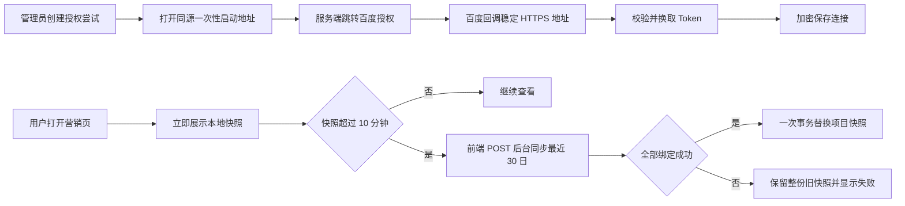

# 营销监控系统一页方案

- 状态：已确认
- 确认日期：2026-07-29
- 当前阶段：产品方向确认，尚未进入实现
- 当前权威实现方案：`../draft-2026-07-29-001-marketing-monitoring/TECH-SPEC.md`

## 一句话定义

在现有 GEO/SEO 系统中增加一个轻量、只读的营销监控功能，第一期只读取百度搜索广告的展现、点击和消费；业务调整仍回到百度营销完成。

## 为什么先做百度

百度营销、官网落地页和内部销售系统目前没有统一业务 ID，落地页与销售系统也尚未提供 API。第一期先交付真实可验证的百度广告监控，不使用 Excel、CSV、人工录入或模拟卡片伪造完整漏斗。

当前业务量较小。未来另外两个系统具备 API 后，采用简单人工关联即可：每条订单只选择一条主要原始咨询，不做自动匹配和多触点归因。

## 业务口径

完整业务过程是：

```text
百度广告或自然访问
    → 官网表单或咨询
    → 市场部确认后进入销售线索池
    → 销售确认进一步合作意向
    → 建立订单
    → 产生订单签订金额
```

当前第一期只监控最前面的百度付费广告事实：

- 展现量；
- 点击量；
- 广告消费；
- 按推广计划的日明细。

原始咨询、订单数量和订单签订金额属于后续联合观察目标。有效线索和销售机会只解释业务过程，不作为未来必接数据。订单签订金额不等于回款、营业收入或毛利。

## 第一阶段产品形态

- 主要用户是市场负责人。
- 管理员负责百度授权、账户绑定、暂停、恢复和断开本地连接。
- 一个监控项目代表一个品牌或业务线，可绑定一个或多个百度搜索广告账户。
- 绑定以整账户为单位；第一期不建设指定推广计划子集配置。
- 页面展示项目汇总、按日趋势和推广计划明细。
- 页面先纯读取本地快照；前端发现快照超过 10 分钟后，再显式请求后台同步固定的最近 30 个自然日。
- 日期筛选只读取这份本地 30 日快照，不按筛选区间调用百度。
- 多账户刷新采用项目级全成全败：全部账户成功后一次提交；任一账户失败则保留整份旧快照。
- 页面只显示一段“落地页和销售数据将在 API 开放后接入”的静态说明。

## 轻量架构方向

沿用现有 Express、Sequelize 和 Next.js 目录，不建设通用来源平台：

```text
backend/
└── modules/marketing/
    ├── index.js
    ├── adapters/BaiduMarketingClient.js
    ├── migrations/
    ├── models/
    ├── routes/
    └── services/

nextjs-frontend/src/
├── app/geo/marketing/page.tsx
├── components/marketing/
└── utils/marketing*.test.cjs
```

百度合同解析只存在于 `BaiduMarketingClient`。业务服务只消费经过校验的搜索广告标准事实。等第二个真实来源出现后，再根据已经出现的重复提取接口，不预建 `SourceRegistry`、连接器平台或通用 ETL。

## 百度授权与数据流程



原始 OAuth state 不进入普通 JSON 或页面 DOM。回调处理后跳转到无敏感 query 的结果页。Access Token 和 Refresh Token 都不是永久凭据，刷新和是否轮换以百度真实合同为准。

## 本地保存的数据

- OAuth 授权尝试：state 哈希、发起管理员、操作目标、授权世代、状态和到期时间。
- 百度连接：外部授权身份、搜索只读能力、加密 Token、到期时间、授权世代和连接状态。
- 项目账户绑定：项目、连接、百度广告账户、当前版本和暂停状态。
- 推广计划日事实：绑定、日期、推广计划、展现、点击和按真实契约固定 scale 归一后的消费。
- 刷新运行：项目、固定同步窗口、状态、执行令牌、错误码和起止时间。

外部 ID、计数和金额使用规范十进制字符串，不经过 JavaScript `Number`。第一期数据量小，汇总使用 `BigInt` 在应用层完成，避免 SQLite 与 PostgreSQL 的精度差异。

## 后续接入方式

落地页系统提供稳定 API 后：

- 只同步原始咨询及必要来源信息；
- 不预先承诺官网访问统计；
- 不把百度点击数当作官网访问量。

销售系统提供稳定 API 后：

- 只同步订单和订单签订金额；
- 不要求有效线索或销售机会进入监控接口。

两个来源都接入后，才增加“每条订单选择一条主要原始咨询”的人工关系，并形成联合观察视图。

## 明确不做

- 不修改百度广告、咨询或订单。
- 不做双向同步、自动身份匹配或多触点归因。
- 不建设微服务、消息队列、数据仓库、通用来源注册表或连接器平台。
- 不用人工数据模拟尚未开放的来源 API。
- 不监控百度推广单元、关键词和创意。
- 不配置推广计划子集。
- 不把百度信息流纳入搜索一期；信息流必须在真实需求和只读权限均确认后单独立项。

## 进入实现前的硬门禁

- 有稳定公网 HTTPS 回调地址。
- 百度应用审核通过并获得搜索广告只读权限。
- 使用官方调试工具或获批账户确认 OAuth、Token、Long ID、金额、分页、日期窗口和业务错误包裹。
- 脱敏合同证据已经形成版本化 manifest，并回写技术规格和自动夹具。

## 验收方向

- 管理员能完成授权、重新授权、断开连接、绑定、暂停和恢复。
- Token 加密保存；迟到回调和并发刷新不能覆盖新凭据。
- 进入页面立即读取本地快照；日期切换不调用百度。
- 全部账户成功后才替换项目快照；失败保留整份旧快照。
- 项目汇总、逐日趋势和全部推广计划合计一致，并与百度后台核对。
- 没有任何百度写操作。
- 当前正式入口在代码实现和生产验收完成前仍是既有 GEO/SEO，营销功能不得被描述为已上线。
